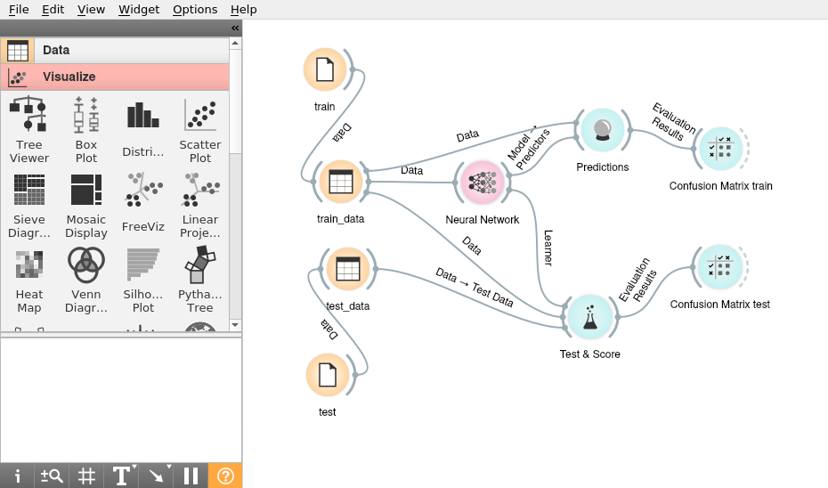
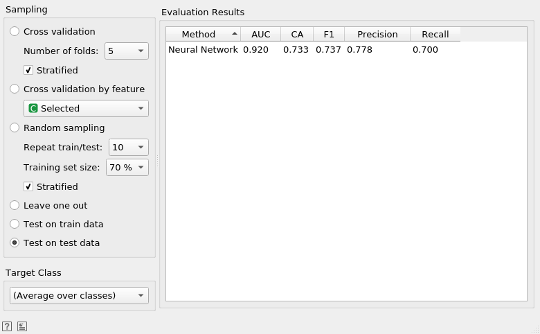
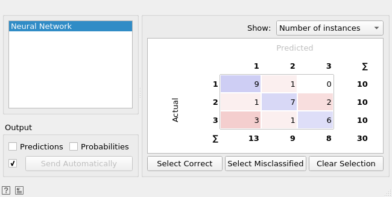
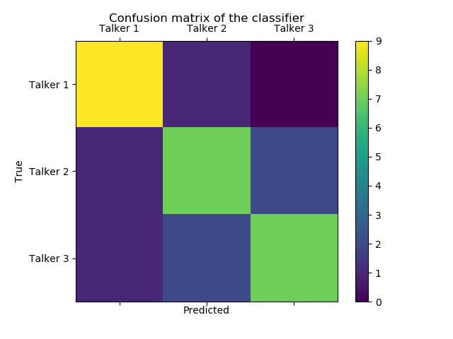

# Voice identifier:
## System For Talker Voice Identification

Voice transmission devices have moved on from simple telephone technology, and many more people are using electronic devices for communication purposes. These devices record and transmit voice signal using [Voice over Internet Protocol (VoIP)](https://en.wikipedia.org/wiki/Voice_over_IP) software, which can deliver much richer voice signal compared to traditional telephone lines that use severely degraded [voiceband](https://en.wikipedia.org/wiki/Voice_frequency) signal. Current abundance of VoIP enabled technologies opens a door for a new user identification method for general purpose authentication based on voice identification. This project aims at developing a robust voice identification system using advanced machine learning techniques. The proposed system can tremendously improve the quality and security of online authentication using voice signal transmitted through VoIP.

<br />

## Summary

This repository uses the [Orange](https://orange.biolab.si/) data visualization, machine learning and data mining toolkit, which has a great visual programming front-end, to recreate the machine-learning procedure used in the original project (see [Voice identifier](https://github.com/h1ke/voice_identifier) repository for details) using Orange's visual programming framework as well as python scripting using the Orange library (Orange uses python under the hood, while the visual programming part is coded in Qt).

<br />

## Orange Canvas and Workflow

In order to recreate our machine-learning procedure , we simply start a new project, or using Orange's terminology, a canvas. We then drag-and-drop all the necessary widgets and appropriately connect the widgets. The screenshot below depicts the resulting canvas with our workflow.

<br />



<br />

We see that training and testing datasets are loaded using the *File* widget and connected to the *Data Table* widget, where data can be examined and if needed subseted. Next step is to connect training data to the *Neural Network* widget, which is a wrapper for [scikit-learn](http://scikit-learn.org/stable/index.html). Most of the parameters are set to the defaults, but we can change some of them by double-clicking on the widget. The selected parameters are shown on the screenshot below.

<br />

 neural network")

<br />

We connect the *Neural Network* widget and the training data to the *Predictions* widget, which is useful when one wants to compare predictions from different models (Orange has many). In our case we want to extract evaluation results and look at a confusion matrix via the *Confusion Matrix* widget.

More importantly, we want to test the trained model on test data. Just like in the python workflow in the main repository, we simply train the model on recordings from time point one and test the model on recordings from time point two. This is achieved via the *Test & Score* widget which is also useful when one wants to compare predictions from different models and testing learning algorithms on data. We connect the *Data Table* widgets from training and testing data as well as the *Neural Network* widget to the *Test & Score* widget. The screenshot below shows the evaluation results computed by the *Test & Score* widget. 

<br />



<br />

Since we had multiple categories, the statistics from the evaluation results above are less informative, but we can see that the overall classification accuracy (column called "CA") is 73%. We need to look at a confusion matrix to better understand the results. Just like the the *Predictions* widget, the *Test & Score* widget outputs evaluation results which we can use as an input to another *Confusion Matrix* widget. The screenshot below depicts our confusion matrix. We see that even with default neural network parameters, our model does rather a good job by achieving an overall accuracy of 73% and almost perfectly categorizing the tokens for the first talker (the native English speaker), but performing more poorly on the other two (the non-native English speakers). This is largely due to the quality of the data (see the main repository for details).

<br />



<br />

While we have used the saved data from the feature extraction procedure used in the main repository, we could have used the *Python Script* widget and inserted the procedure directly into our Orange workflow. 

<br />

## Python script way

Orange is the best when used as a visual programming front-end, but one can choose to use its capabilities in python directly. The code walk-through below shows how to perform the same procedure as the above using python scripting.

<br />

First, we import all the necessary libraries, including Orange.

```python
import Orange
import matplotlib.pyplot as plt #plotting
import os #os dependent functions
```

Next, we define and load the train and test data. We use the .tab files previously saved from within Orange workflow in order to get proper variable coding.

```python
train = Orange.data.Table("training_feature_tokens.tab")
test = Orange.data.Table("test_feature_tokens.tab")
```
Then, we define our learning algorithm, which is a Multilayer perceptron (MLP) neural network using sklearn.neural_network.MLPClassifier wrapper.

```python
learner = Orange.classification.NNClassificationLearner(hidden_layer_sizes=(100,100), activation='logistic', solver='adam', alpha=0.0001, batch_size='auto', learning_rate='constant', learning_rate_init=0.001, power_t=0.5, max_iter=100, shuffle=True, random_state=None, tol=0.0001, verbose=False, warm_start=False, momentum=0.9, nesterovs_momentum=True, early_stopping=False, validation_fraction=0.1, beta_1=0.9, beta_2=0.999, epsilon=1e-08, preprocessors=None)
```
Next we train the model.

```python
classifier = learner(train)
```

Then, we can test the model using our test data.

```python
result = Orange.evaluation.testing.TestOnTestData(train,test,[learner])
print("Accuracy: %.3f" % Orange.evaluation.scoring.CA(result)[0])
```
Which returns the accuracy of 70% (see the discussion in the main repository regarding accuracy fluctuation for this data).

We can also use other testing methods. For instance, the following code will perform a 5 fold cross-validation. However, this method is using the training data and is not useful for our purposes.

```python
#res = Orange.evaluation.CrossValidation(train, [learner], k=5)
#print("Accuracy: %.3f" % Orange.evaluation.scoring.CA(res)[0])
#print("Area Under the Curve:      %.3f" % Orange.evaluation.scoring.AUC(res)[0])
```
Leave one out method is also available, but again it is using the training data.
```python
#res = Orange.evaluation.LeaveOneOut(train, [learner])
#print("Accuracy: %.3f" % Orange.evaluation.scoring.CA(res)[0])
#print("Area Under the Curve:      %.3f" % Orange.evaluation.scoring.AUC(res)[0])
```

We can plot a confusion matrix using the same method used in the main repository, but from the date obtained from Orange.

```python
conf = Orange.evaluation.scoring.skl_metrics.confusion_matrix(result.actual, result.predicted[0]) #, result.domain.class_var.values)
labels = ['Talker 1', 'Talker 2', 'Talker 3']
fig = plt.figure()
ax = fig.add_subplot(111)
cax = ax.matshow(conf)
plt.title('Confusion matrix of the classifier')
fig.colorbar(cax)
ax.set_xticklabels([''] + labels)
ax.set_yticklabels([''] + labels)
plt.xlabel('Predicted')
plt.ylabel('True')
plt.show()
```

<br />



<br />

## Code and Resources

* **README.md** This file.
* **[LICENSE](LICENSE)** This software is covered under [Creative Commons Attribution-NonCommercial-ShareAlike 4.0 International (CC BY-NC-SA 4.0)](https://creativecommons.org/licenses/by-nc-sa/4.0/#)
* **[voice_identifier.ows](voice_identifier.ows)** Main Orange workflow file in XML with widget descriptions and parameters saved in python's serialization format (i.e. pickle format) walk through code with full annotations and explanations.
* **Data** Extracted features data can be found in the folder called [data](./data). It is in Orange's .tab format which uses special three row header for defining data types and formats.

<br />

## Contact

Feel free to contact me via [GitHub](https://github.com/h1ke).